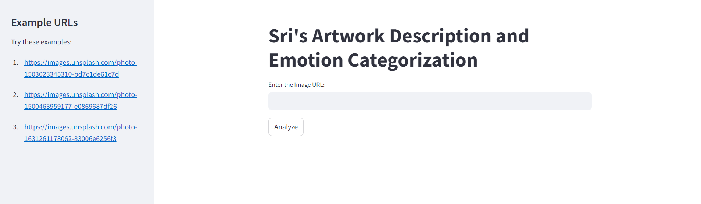
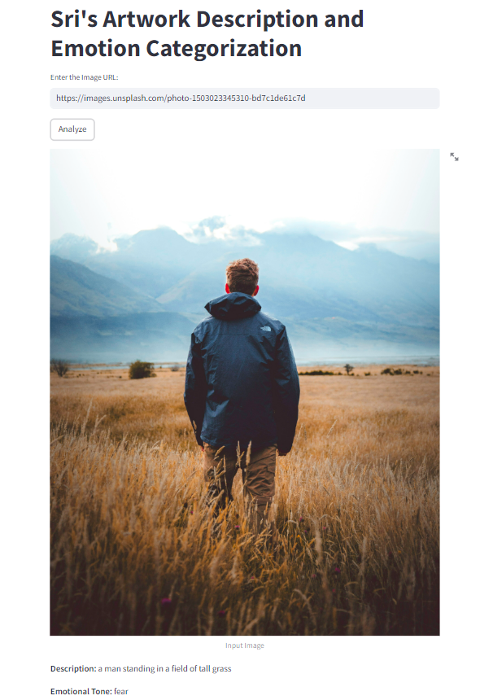

<h1>AI-Powered Artwork Description and Emotion Categorization</h1>
<h3>Overview</h3>
This Python application is used to generate detailed descriptions of artworks from image URLs and categorizes these descriptions based on their emotional tone. 
<h3>Features</h3>

Image-to-Text Generation: Converts an image into a descriptive text using a pre-trained model from Hugging Face.

Emotion Analysis: Categorizes the emotional tone of the generated description (e.g., happy, sad, neutral) using sentiment analysis models.

Simple Interface: Accepts an image URL as input and provides the generated description along with its emotional tone.

<h3>Prerequisites</h3>

Before running the script, ensure you have the following installed:

*Python 3.7 or higher

Required Python libraries:
*requests

*transformers (from Hugging Face)

*torch (for running models)

*Pillow (for image processing)

You can install the necessary packages using the command: <h3>pip install -r requirements.txt</h3>

Well known streamlit is used for running this application (i.e to create a user-friendly interface)

* To run the project - <h3>streamlit app run.py</h3>

<h1> Output Samples </h1>
You can paste your image address to fetch the emotion and generate a descriptive caption to it and also in addition we're providing you 3 images for better
understanding of the project.
<h2>Interface</h2>

<h3>OutputSamp1</h3>

<h3>OutputSamp2</h3>

<h3>OutputSamp3</h3>

